<picture><source media="(prefers-color-scheme: dark)" srcset="assets/theme-hero-dark-32195b559a5c.svg" /><source media="(prefers-color-scheme: light)" srcset="assets/theme-hero-light-029cac8d9717.svg" /></picture>

# Hi, I'm Perfecto 👋

I'm a **full-stack engineer based in Shenzhen**, building AI agents, developer tooling, and reliable workflows. I enjoy turning interesting ideas into useful software—and making the path from idea to production a little smoother.

Outside the editor, you'll find me hiking or playing badminton.

[Email](mailto:kepengcheng314@gmail.com) · [GitHub](https://github.com/Perfecto23) · [TokenTracker](https://www.tokentracker.cc/u/b6f3aece-2e2d-4764-91aa-963aa814aca0)

<picture><source media="(prefers-color-scheme: dark)" srcset="assets/theme-asset-01-dark-374787a92cd1.svg" /><source media="(prefers-color-scheme: light)" srcset="assets/theme-asset-01-light-0978a3137796.svg" /></picture> <picture><source media="(prefers-color-scheme: dark)" srcset="assets/theme-asset-02-dark-1ec70435883f.svg" /><source media="(prefers-color-scheme: light)" srcset="assets/theme-asset-02-light-0c9fddd39b35.svg" /></picture> <picture><source media="(prefers-color-scheme: dark)" srcset="assets/theme-asset-03-dark-d1bb89882edf.svg" /><source media="(prefers-color-scheme: light)" srcset="assets/theme-asset-03-light-47edb767225a.svg" /></picture>

<!-- BEGIN AUTO:PROJECTS -->

<strong>Contributed to:</strong> <a href="https://github.com/Tencent/WeKnora">Tencent WeKnora</a> · <a href="https://github.com/heroui-inc/heroui-cli">heroui-cli</a> · <a href="https://github.com/langgenius/dify">Dify</a> · <a href="https://github.com/pnpm/pnpm">pnpm</a> · <a href="https://github.com/web-infra-dev/rspack">Rspack</a>

<!-- END AUTO:PROJECTS -->

---

## ✨ AI coding usage

<!-- BEGIN AUTO:AI -->

<picture><source media="(prefers-color-scheme: dark)" srcset="assets/theme-ai-usage-30d-dark-b7c8ce7d1e16.svg" /><source media="(prefers-color-scheme: light)" srcset="assets/theme-ai-usage-30d-light-a5408a49b23d.svg" /></picture>

<!-- END AUTO:AI -->

---

💻 My Technology Stack (Click to expand)

<h3>📋 Frontend</h3>

                          

<h3>💾 Backend</h3>

           

<h3>🎛️ DevOps</h3>

       

<h3>💻 IDEs/Editors</h3>

    

<h3>🧑‍💻 Develop Forum</h3>

     

---

## 📊 Github Stats

### 🔥 Streak & Activity

<picture><source media="(prefers-color-scheme: dark)" srcset="assets/theme-streak-dark-329cdfd54fb5.svg" /><source media="(prefers-color-scheme: light)" srcset="assets/theme-streak-light-ea75b378e95e.svg" /></picture>

<picture><source media="(prefers-color-scheme: dark)" srcset="assets/theme-github-stats-dark-5a9513f518ba.svg" /><source media="(prefers-color-scheme: light)" srcset="assets/theme-github-stats-light-d094cdedbac2.svg" /></picture>

More GitHub stats

<picture><source media="(prefers-color-scheme: dark)" srcset="assets/theme-github-stats-original-rank-dark-8eab11f458f0.svg" /><source media="(prefers-color-scheme: light)" srcset="assets/theme-github-stats-original-rank-light-e19bf30bcc24.svg" /></picture>

### 💻 Most Used Languages

<picture><source media="(prefers-color-scheme: dark)" srcset="assets/theme-languages-compact-dark-4a142bd1439e.svg" /><source media="(prefers-color-scheme: light)" srcset="assets/theme-languages-compact-light-79c8e9f6bc57.svg" /></picture>

<picture><source media="(prefers-color-scheme: dark)" srcset="assets/theme-languages-bars-dark-014955cace3a.svg" /><source media="(prefers-color-scheme: light)" srcset="assets/theme-languages-bars-light-227023a873f5.svg" /></picture>

Original language donut

<picture><source media="(prefers-color-scheme: dark)" srcset="assets/theme-languages-donut-dark-2ceec19d8acc.svg" /><source media="(prefers-color-scheme: light)" srcset="assets/theme-languages-donut-light-930ead092285.svg" /></picture>

### 📊 Language Distribution

<picture><source media="(prefers-color-scheme: dark)" srcset="assets/theme-languages-repo-dark-9ef1dbf7d3ee.svg" /><source media="(prefers-color-scheme: light)" srcset="assets/theme-languages-repo-light-17783511c85c.svg" /></picture>

<picture><source media="(prefers-color-scheme: dark)" srcset="assets/theme-languages-commit-dark-bf595815065f.svg" /><source media="(prefers-color-scheme: light)" srcset="assets/theme-languages-commit-light-7e435568a7eb.svg" /></picture>

### 📈 Activity Graph

<!-- BEGIN AUTO:ACTIVITY -->

<picture><source media="(prefers-color-scheme: dark)" srcset="assets/theme-activity-graph-dark-a9cce16da77e.svg" /><source media="(prefers-color-scheme: light)" srcset="assets/theme-activity-graph-light-71f65e103386.svg" /></picture>

<!-- END AUTO:ACTIVITY -->

### 📊 GitHub Overview

<picture><source media="(prefers-color-scheme: dark)" srcset="assets/theme-overview-dark-67c6ccf76c3b.svg" /><source media="(prefers-color-scheme: light)" srcset="assets/theme-overview-light-7c059ed48ead.svg" /></picture>

### 🏆 Achievements

<picture><source media="(prefers-color-scheme: dark)" srcset="assets/theme-milestones-dark-b3e774963f4b.svg" /><source media="(prefers-color-scheme: light)" srcset="assets/theme-milestones-light-29bd22cbdfe4.svg" /></picture>

### ⏱️ Coding Time & Stats

<picture><source media="(prefers-color-scheme: dark)" srcset="assets/theme-productive-time-dark-dae636c03989.svg" /><source media="(prefers-color-scheme: light)" srcset="assets/theme-productive-time-light-1c219c0b8ebd.svg" /></picture>

### 🐍 Contribution Snake

<picture><source media="(prefers-color-scheme: dark)" srcset="assets/theme-snake-light-dark-886391301aeb.svg" /><source media="(prefers-color-scheme: light)" srcset="assets/theme-snake-light-light-9ca3ec22fe72.svg" /></picture>

---
