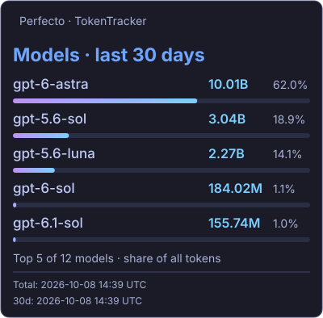
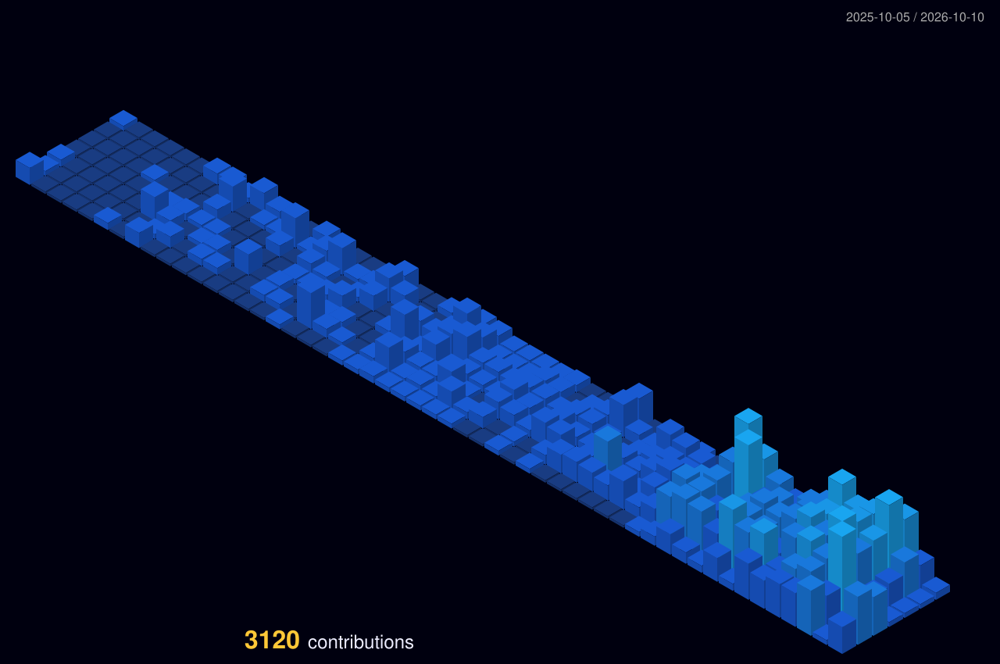
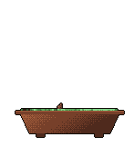

 

[English](README.md) · 简体中文

# 关于我

👋 你好，我是 Perfecto，一名生活在深圳的软件工程师。我在 MoeGo 构建 AI 产品、平台和开发者工具，以全栈视角参与从想法到上线的整个过程。

🛠️ 我的工作涵盖解决实际业务问题的智能体，以及支撑它们的公共基础设施：运行时、系统集成、评估、可观测性和交付。我关注如何把有潜力的实验变成可靠的系统，也希望把反复出现的工程问题沉淀为可供他人复用的能力。

🤖 我也在探索团队如何更好地使用 AI 开发：构建可复用的工具，改进开发与测试流程，并与工程、产品和设计团队协作，让智能体工作流融入日常实践。

🏔️ 我喜欢创造有趣的东西、钻研难题，也乐于分享所学。工作之外，我喜欢文学、哲学、登山和羽毛球。一起持续学习，动手创造。

[邮箱](mailto:kepengcheng314@gmail.com) · [GitHub](https://github.com/Perfecto23) · [TokenTracker](https://www.tokentracker.cc/u/b6f3aece-2e2d-4764-91aa-963aa814aca0)

  

<!-- BEGIN AUTO:PROJECTS -->

<strong>参与贡献的项目：</strong> <a href="https://github.com/Tencent/WeKnora">Tencent WeKnora</a> · <a href="https://github.com/heroui-inc/heroui-cli">heroui-cli</a> · <a href="https://github.com/langgenius/dify">Dify</a> · <a href="https://github.com/pnpm/pnpm">pnpm</a> · <a href="https://github.com/web-infra-dev/rspack">Rspack</a>

<!-- END AUTO:PROJECTS -->

---

## ✨ AI 编程用量

 

[查看 TokenTracker 主页](https://www.tokentracker.cc/u/b6f3aece-2e2d-4764-91aa-963aa814aca0) · 公开主页总量（365 天）· 最近 30 天模型用量分布

---

💻 我的技术栈（点击展开）

<h3>📋 前端</h3>

                          

<h3>💾 后端</h3>

           

<h3>🎛️ DevOps</h3>

       

<h3>💻 开发工具／编辑器</h3>

    

<h3>🧑‍💻 开发者社区</h3>

     

---

## 📊 GitHub 统计

 

### 💻 最常用语言 · ⏱️ 编码时间与统计

 

### 📊 语言分布

 

### 📈 活动图表

### 📊 GitHub 概览

<picture>
  <source media="(max-width: 600px)" srcset="assets/overview-mobile.svg" />
  
</picture>

### 🏆 成就奖杯

<picture>
  <source media="(max-width: 600px)" srcset="https://github-stats.perfecto23.com/trophy?v=2&amp;username=Perfecto23&amp;theme=tokyonight&amp;no-frame=true&amp;column=2&amp;row=5&amp;margin-w=12&amp;margin-h=16" />
  
</picture>

## 🌱 动起来的贡献记录

### 🌃 贡献夜景

### 🌳 从 GitHub 历史中生长的盆景

### 🐍 贡献贪吃蛇

---

使用 [dither-portrait](https://github.com/0xharkirat/dither-portrait), [YourTomo](https://github.com/prsdx/YourTomo), [git-bonsai](https://github.com/egorthinks/git-bonsai) 和 [snk](https://github.com/Platane/snk) 制作。[作品与资源署名](THIRD_PARTY_NOTICES.md)。
