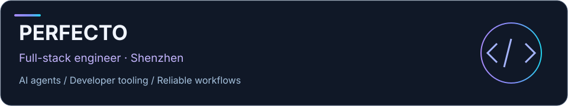

# Hi, I'm Perfecto 👋

I'm a **full-stack engineer based in Shenzhen**, building AI agents, developer tooling, and reliable workflows. I enjoy turning interesting ideas into useful software—and making the path from idea to production a little smoother.

Outside the editor, you'll find me hiking or playing badminton.

[Email](mailto:kepengcheng314@gmail.com) · [GitHub](https://github.com/Perfecto23) · [TokenTracker](https://www.tokentracker.cc/u/b6f3aece-2e2d-4764-91aa-963aa814aca0)

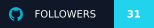 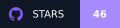 

<!-- BEGIN AUTO:PROJECTS -->

<strong>Contributed to:</strong> <a href="https://github.com/Tencent/WeKnora">Tencent WeKnora</a> · <a href="https://github.com/heroui-inc/heroui-cli">heroui-cli</a> · <a href="https://github.com/langgenius/dify">Dify</a> · <a href="https://github.com/pnpm/pnpm">pnpm</a> · <a href="https://github.com/web-infra-dev/rspack">Rspack</a>

<!-- END AUTO:PROJECTS -->

---

## ✨ AI coding usage

<!-- BEGIN AUTO:AI -->

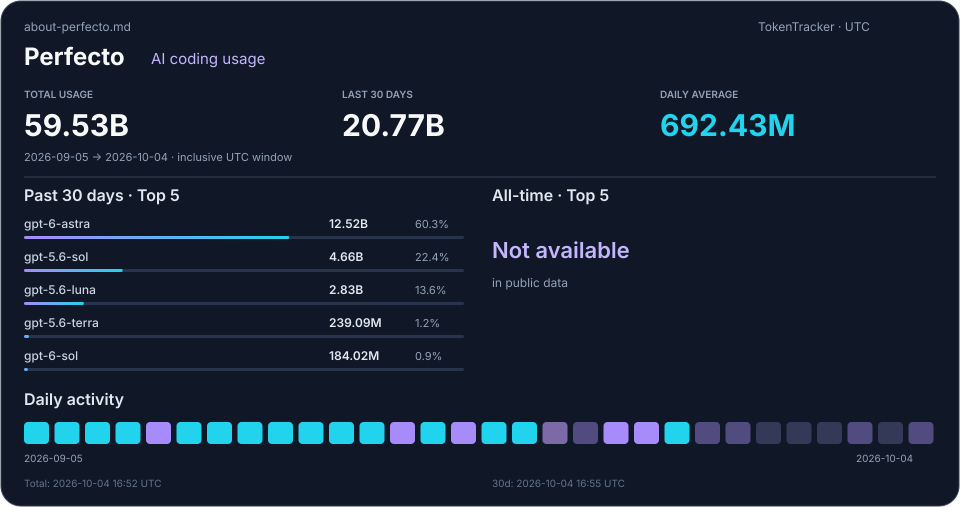

<!-- END AUTO:AI -->

---

💻 My Technology Stack (Click to expand)

<h3>📋 Frontend</h3>

  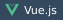 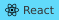      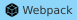          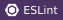       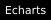

<h3>💾 Backend</h3>

           

<h3>🎛️ DevOps</h3>

       

<h3>💻 IDEs/Editors</h3>

   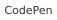 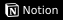

<h3>🧑‍💻 Develop Forum</h3>

  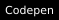   

---

## 📊 Github Stats

### 🔥 Streak & Activity


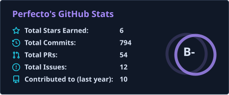

More GitHub stats


### 💻 Most Used Languages


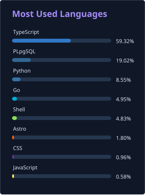

Original language donut


### 📊 Language Distribution

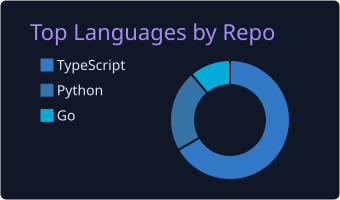

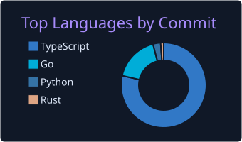

### 📈 Activity Graph

<!-- BEGIN AUTO:ACTIVITY -->

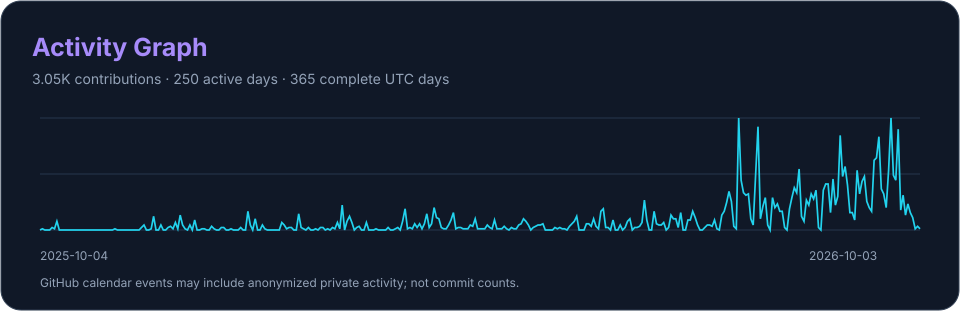

<!-- END AUTO:ACTIVITY -->

### 📊 GitHub Overview

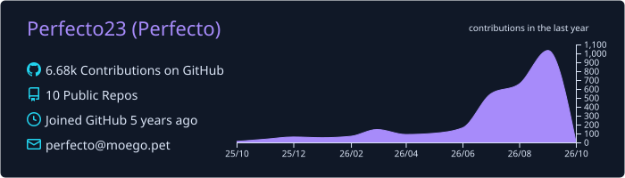

### 🏆 Achievements

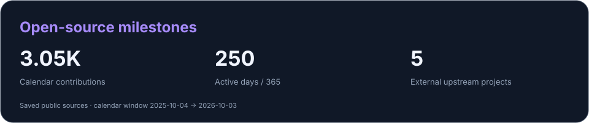

### ⏱️ Coding Time & Stats

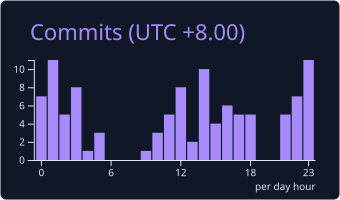

### 🐍 Contribution Snake


---
